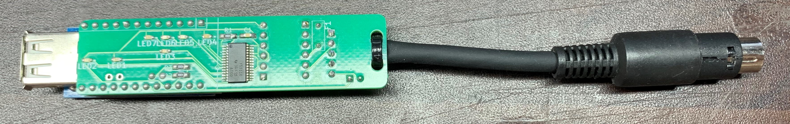
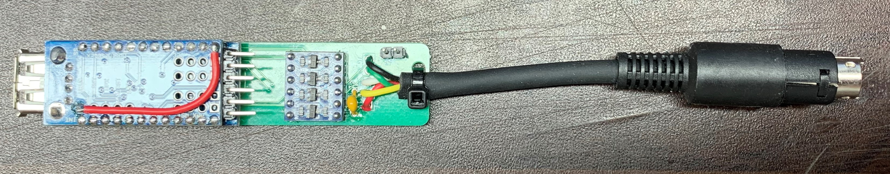
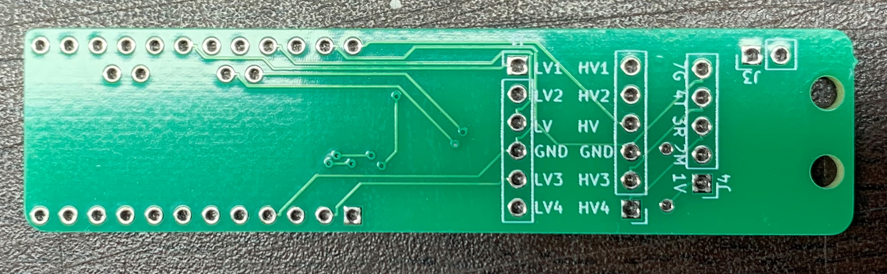
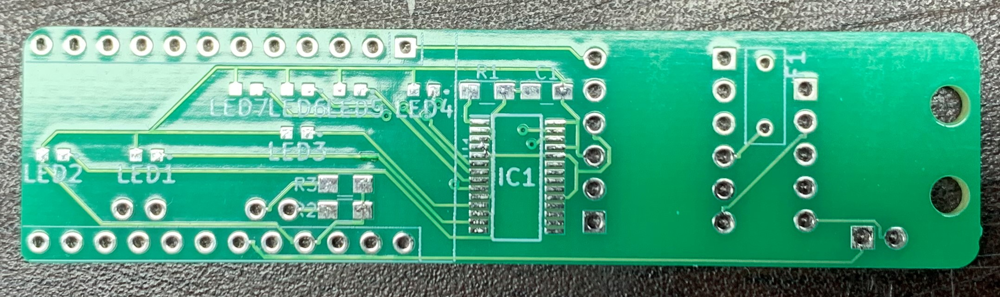
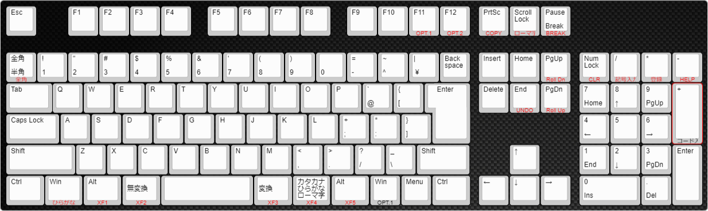

# USBKBD2X68K

USBKBD2X68K とは USBキーボードをX68000で使えるようにしたものです。

## 注意
全てのUSB機器に対して稼働確認が取れているわけではありません。
相性等動かないものもありますのでご了承ください。
また、ゲーミングキーボード等電力を多く使用するものも使用できません

## 完成品

## ガーバーデータ

## 配線図

C1 0.1uf
R1 1.2k
R2,R3 4.7k

## キーアサイン
109キーボードではすべてのキーをアサインすることができません。
ですので使用頻度の低いキーをアサインしていません。
日本語109キーボードアサイン例 `赤字部分がX68000のキーアサイン`

## Setup
* PlatformIO を使用しています。
 ライブラリとしてUSB_Host_Shield_2.0 を使用しています。
  (https://github.com/felis/USB_Host_Shield_2.0) 
 ライブラリとしてMsTimer2 を使用しています。
  (http://playground.arduino.cc/Main/MsTimer2)

arduino pro mini(3.3v)
https://www.amazon.co.jp/gp/product/B073PYLJDC/ref=ppx_yo_dt_b_asin_title_o00_s00?ie=UTF8&psc=1
ミニusbホストシールド2.0
https://www.amazon.co.jp/gp/product/B074HTPK13/ref=ppx_yo_dt_b_asin_title_o00_s00?ie=UTF8&psc=1
レベル変換
https://www.amazon.co.jp/gp/product/B014F8ZEVM/ref=ppx_yo_dt_b_asin_title_o01_s00?ie=UTF8&psc=1
TLC59116IPWR(LEDドライバ)
https://akizukidenshi.com/catalog/g/gI-13887/

1.ミニusbホストシールド2.0の5V改造
ミニusbホストシールド2.0はUSB電源が3.3Vになっているので
5Vになるようにします。また、RAWに5V供給すればarduino pro mini(3.3v)は
レギュレーターで3.3Vで駆動します
方法は以下
VBUS パターンカット（赤丸部分）

2.ミニusbホストシールド2.0とarduino pro mini 3.3vの結合
って言っても重ねて半田します

3.arduino pro mini 3.3vとレベル変換＆minidin7Pの接続
arduino pro mini 3.3vなので
x68 5Vと接続するためにレベル変換との結合

 minidin7P  - レベル変換 -  Arduino Pro Mini
  1 Vcc(5V) -  HV        -  RAW(5V)
  2 MSDATA  -  HV1  LV1  -  1(TXD)
  3 KYRXD   -  HV2  LV2  -  14(A0)
  4 KYTXD   -  HV3  LV3  -  15(A1)
  5 KYREADY
  6 KYRMT
  7 GND     -  GND  GND  -  GND
                     LV  -  VCC(3.3V)

